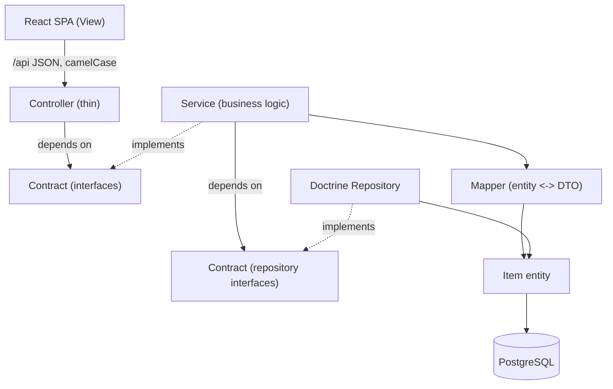
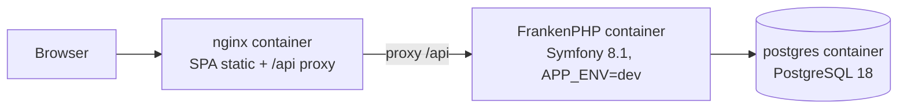
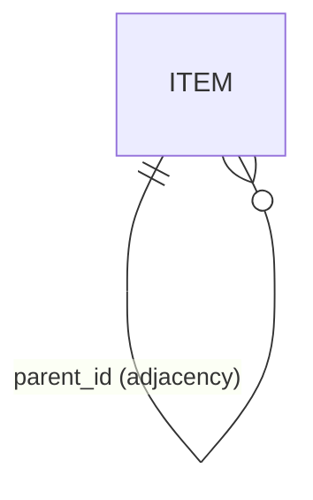

# Architecture Spine — File System App

## Design Paradigm

Layered modular monolith behind a REST/JSON boundary: a Symfony application
holds Model and Controller; the React SPA is the View, talking to the backend
only through the `/api` JSON surface. Layers run strictly
`Controller → Service → Repository` through interfaces in `src/Contract/`;
`src/Mapper/` is the only place entities and DTO models translate. The named
pattern is MVC with the V moved across a process boundary.



## Inherited Invariants

From `AGENTS.md` and the PRD — binding, read-only; this spine does not re-decide them.

| Inherited | From | Binds here |
| --- | --- | --- |
| Layering + `src/Contract/` + `src/Mapper/` + DTO Read/Write | AGENTS.md §3 | All backend code |
| API conventions: camelCase JSON, error envelope vocabulary, status table (incl. POST 404, 409 with field `details`), pagination metadata | AGENTS.md §4 | Every endpoint |
| Testing: real PostgreSQL via Testcontainers, backend only; unit tests for validation | AGENTS.md §6, D6 | Test suite |
| PHPStan / PHP-CS-Fixer / GitHub Actions CI | AGENTS.md §8, D7 | Tooling |
| Performance principles: indexes in migrations, no N+1, query-count assertions, paginated collections | AGENTS.md §5 | Data access layer |
| FR/NFR contracts incl. normalized-name matching, pagination 50/100, atomic cascade delete | PRD §4 | All features |

## Invariants & Rules

### AD-1 — One table, one tree `[ADOPTED]`

- **Binds:** FR-1…FR-9, NFR-1
- **Prevents:** divergent File/Folder schemas, application-side uniqueness checks that race.
- **Rule:** a single `item` table holds Folders and Files, distinguished by a
  `type` discriminator (`folder` | `file`). Sibling uniqueness across types is
  enforced by the database: `UNIQUE (parent_id, normalized_name)`. No second
  hierarchy table, no path column, no closure table.

### AD-2 — Adjacency list; SQL owns recursion in both directions

- **Binds:** FR-6, FR-7, FR-8, FR-9
- **Prevents:** per-unit traversal drift (PHP recursion vs SQL walks) and N+1 ancestor loops.
- **Rule:** the hierarchy is `item.parent_id → item.id`. Subtree operations
  (cascade delete, scoped search) and the ancestor walk that builds
  `parentPath` are each a single PostgreSQL recursive CTE (`WITH RECURSIVE`).
  Application code never walks the tree in a loop.

### AD-3 — `normalized_name` owns all matching; one normalizer owns the column

- **Binds:** FR-1, FR-4, FR-7, FR-8, FR-9
- **Prevents:** collation-dependent comparisons and mixed case rules between endpoints.
- **Rule:** every item stores `name` (display casing) and `normalized_name`
  (case-folded, NFC), stored with a deterministic C collation so uniqueness,
  ordering, and prefix matching all compare the same bytes. Exactly one
  `NameNormalizer` (stateless final class) produces the value — used by
  create, rename, AND the normalization of incoming search/suggestion input.
  The database never folds; it compares stored bytes. Nothing ever matches on
  `name`.

### AD-4 — The Root is a protected, well-known NULL-parent row

- **Binds:** FR-1, FR-4, FR-6, UJ-1 bootstrap
- **Prevents:** multi-root trees, orphan-handling ambiguity, and SPA boot with no entry id.
- **Rule:** exactly one pre-seeded root row has `parent_id IS NULL`, enforced
  by a partial unique index (`WHERE parent_id IS NULL`). The root's id is a
  fixed UUID v7 constant seeded by the first migration and stated in the
  README — the SPA bootstraps from it; no discovery endpoint exists. Service
  guards reject rename and delete of the root with `400 validation_failed`.

### AD-5 — One transaction per write; cascade delete is all-or-nothing

- **Binds:** FR-1, FR-4, FR-5, FR-6
- **Prevents:** partial deletes and duplicate-name windows.
- **Rule:** every mutating service call opens one transaction. Cascade delete
  collects the subtree ids with a recursive CTE and deletes them in that same
  transaction. No write path may commit partially.

### AD-6 — API surface is fixed

- **Binds:** all frontend↔backend interaction (FR-1…FR-9)
- **Prevents:** route and payload drift between independently built SPA and API.
- **Rule:** exactly these endpoints, camelCase payloads, envelope and codes per
  AGENTS.md §4. `POST`/`PATCH` bodies carry `name` (required, non-optional);
  unknown JSON fields are ignored (lenient reads, strict writes). A file id
  where a folder id is addressed (`GET /api/folders/{id}/items`,
  `folderId=`) yields `404 not_found`. Search returns Files only — folders are
  never search results (PRD FR-7/FR-8).

| Method & path | Purpose | Success |
| --- | --- | --- |
| `GET /api/folders/{id}/items?limit&offset` | List folder contents (FR-2) | 200 + page |
| `POST /api/folders` `{parentId?, name}` | Create folder (FR-1); null/omitted `parentId` = root | 201 + Location |
| `POST /api/files` `{parentId, name}` | Create file (FR-3) | 201 + Location |
| `GET /api/items/{id}` | Fetch item detail incl. `parentPath` (FR-9 selection) | 200 |
| `PATCH /api/items/{id}` `{name}` | Rename (FR-4) | 200 |
| `DELETE /api/items/{id}` | Delete file / cascade folder (FR-5, FR-6) | 204 |
| `GET /api/search?name=&scope=folder\|all&folderId=&limit&offset` | Exact search, files only (FR-7, FR-8) | 200 + page |
| `GET /api/suggestions?prefix=` | Top-10 typeahead (FR-9); blank prefix → 200 with empty `items` | 200 |

Listings are ordered folders-first, then `normalized_name`, then `id` —
stable across pages (FR-2). A folder addressed by a file id is `404`, a
nonexistent parent on create is `404`, duplicates are `409` with field
`details` — per AGENTS.md §4.

### AD-7 — Suggestions ride a partial prefix index

- **Binds:** FR-9, NFR-2
- **Prevents:** sequential scans and unstable ordering at 100k files.
- **Rule:** a partial btree index `(normalized_name text_pattern_ops, id)
  WHERE type = 'file'` serves the typeahead: `LIKE 'prefix%'`, `LIMIT 10`,
  ordered by `normalized_name, id`. The endpoint returns at most 10 rows and
  never aggregates anything else.

### AD-8 — Three-service runtime, one origin, debug by Symfony

- **Binds:** NFR-3, SM-1
- **Prevents:** CORS drift and split-origin assumptions between dev and compose.
- **Rule:** `docker compose up` starts nginx (serves the built SPA, proxies
  `/api` to the app), the FrankenPHP app container (Symfony
  `APP_ENV=dev`, `APP_DEBUG=1`, worker mode off), and PostgreSQL. The browser
  sees one origin. Local dev uses the Vite dev server proxying `/api` to the
  app container — same paths, no CORS anywhere.

### AD-9 — Response read models are pinned; `src/types` mirrors them

- **Binds:** all SPA↔API success traffic (FR-1…FR-9)
- **Prevents:** the compliant-API-meets-compliant-SPA integration failure.
- **Rule:** success responses use exactly these shapes (camelCase), mirrored
  1:1 in the frontend's `src/types`:

```
Page<T>        { "items": T[], "total": int, "limit": int, "offset": int }
ItemSummary    { "id": uuid, "type": "folder"|"file", "name": string, "parentId": uuid|null }
ItemDetail     ItemSummary + { "parentPath": { "id": uuid, "name": string }[] }   // root-first, item excluded
```

- Listing (`GET /folders/{id}/items`) → `Page<ItemSummary>`.
- `POST /folders`, `POST /files`, `PATCH /items/{id}` → `ItemSummary` in the
  body; `Location` on POST points at `GET /api/items/{id}`.
- `GET /items/{id}` → `ItemDetail`.
- Search (`GET /search`) → `Page<ItemDetail>` — `parentPath` distinguishes
  same-named files (FR-8).
- Suggestions (`GET /suggestions`) → `{ "items": { "id": uuid, "name": string,
  "parentPath": { "id": uuid, "name": string }[] }[] }` — always files, ≤ 10,
  no page metadata.
- The error envelope carries `details` only on `400` and `409`; `404`/`500`
  carry `code` and `message` only.

## Consistency Conventions

| Concern | Convention |
| --- | --- |
| Naming | Entities/DTOs `PascalCase`; DB columns `snake_case`; JSON `camelCase` (AGENTS.md D3); interfaces `*Interface` in `src/Contract/` |
| IDs | UUIDs v7 — time-ordered so inserts keep near-sequential btree locality; opaque strings in JSON; the root is a fixed published constant (AD-4). bigint would be marginally smaller/faster but buys nothing this scope needs (user decision) |
| Dates | `timestamptz` UTC in DB, ISO-8601 strings in JSON |
| Errors | AGENTS.md §4 envelope, fixed code vocabulary, `details[].field` on 400/409 only |
| State mutation | Services only, one transaction per call (AD-5); controllers never touch Doctrine |
| Config | `.env` for local, compose env for containers; `.env.example` tracked, `.env` never |
| Logging | Symfony monolog; no stack traces in 500 responses |

## Stack

Verified current at authoring (2026-09-30/10-01); the code owns detail once scaffolded.

| Name | Version |
| --- | --- |
| PHP | 8.5 |
| Symfony | 8.1 (hop to 8.2 LTS at scaffold if released) |
| Doctrine ORM | 3.7 |
| PHPUnit | 13.3 |
| PostgreSQL | 18 |
| Node.js (LTS) | 24 (bump to 26 LTS trivially when adopted) |
| React | 19.3 |
| Vite | 8 |
| FrankenPHP | 1.12 |
| nginx | 1.30 (stable branch) |

## Structural Seed





`item`: `id` uuid v7 pk · `parent_id` uuid null fk→item · `type`
(`folder`\|`file`) · `name` text · `normalized_name` text `COLLATE "C"` ·
`UNIQUE(parent_id, normalized_name)` · `UNIQUE INDEX WHERE parent_id IS NULL`
(AD-4) · `INDEX (parent_id, type DESC, normalized_name, id)` — serves the
folders-first listing order ('file' < 'folder' byte-wise, so `type DESC` puts
folders first) · partial prefix index per AD-7.

```text
{root}/
  backend/    Symfony: src/{Controller,Service,Repository,Contract,Mapper,Entity,DTO/{Read,Write},Exception,EventListener}
  frontend/   Vite + React + TS: src/{api,components,hooks,pages,types,utils}
  compose.yaml · nginx/ · .github/workflows/
```

## Capability → Architecture Map

| Capability / Area | Lives in | Governed by |
| --- | --- | --- |
| FR-1/FR-3 create folder/file | `Service/ItemService`, `DTO/Write/CreateItem`, `NameNormalizer` | AD-1, AD-3, AD-5, AD-6, AD-9 |
| FR-2 listing | `Repository` (paged, folders-first ordered) | AD-1, AD-6, AD-9 |
| FR-4 rename | `Service/ItemService` | AD-3, AD-5 |
| FR-5/FR-6 delete + cascade | `Service/ItemService` + recursive CTE | AD-2, AD-4, AD-5 |
| FR-7/FR-8 exact search (files only) | `Repository` + CTE scope | AD-2, AD-3, AD-6, AD-9 |
| FR-9 suggestions | `Repository` prefix query | AD-7, AD-9 |
| NFR-1/2 performance | indexes + query-count tests + benchmark script | AD-2, AD-7, inherited perf principles |
| NFR-3 run/deploy | compose + README | AD-8 |

## Deferred

- NFR-1/2 measurement: functional tests assert query counts on listing,
  search, and suggestions; NFR numbers (200 ms p95, 10 s / 10k delete) are
  verified once at delivery with a seeded benchmark script (100k corpus incl.
  worst-case shared prefix) — a dev tool, not CI.
- Doctrine migration naming, fixture/seed strategy (beyond the root seed) —
  scaffold-time detail.
- CI workflow steps beyond AGENTS.md §8 — ticketed with the pipeline.
- FrankenPHP worker mode / opcache tuning — the debug take-home doesn't need it.
- Redis — explicitly absent (D2).
- Frontend component breakdown — owned by the SPA build per AGENTS.md §3.
